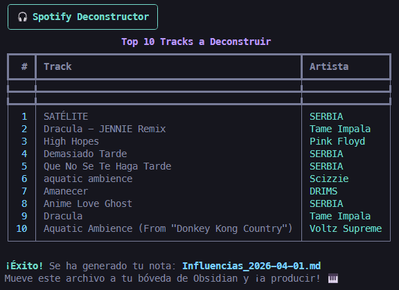

# 🎧 Spotify Deconstructor para Obsidian

Un script en Python diseñado para productores musicales y analistas. Se conecta a la API de Spotify, extrae tu top 10 de canciones más escuchadas a corto plazo y genera automáticamente una nota en formato Markdown lista para integrarse en **Obsidian** (o cualquier editor de notas). 

El objetivo es facilitar el proceso de "deconstrucción musical" (analizar texturas, tempos y arreglos) de las influencias más recientes del usuario.

 ## ✨ Características
* **Integración con la API de Spotify** usando OAuth2 (multi-usuario).
* **Interfaz de terminal fluida** y estilizada gracias a la librería `rich`.
* Generación automatizada de plantillas **Markdown / YAML** para gestión del conocimiento.
* Protección de credenciales mediante variables de entorno.

## 🛠️ Tecnologías utilizadas
* Python 3
* `spotipy` (Wrapper para la API de Spotify)
* `python-dotenv` (Gestión de variables de entorno)
* `rich` (Estilizado visual en consola)

## 🚀 Instalación y uso local

### 1. Clonar el repositorio
```bash
git clone https://github.com/korearn/spotify-deconstructor.git
cd spotify-deconstructor
```

### 2. Configurar el entorno virtual
Es muy recomendable usar un entorno virtual para no tener conflictos con las dependencias.
```bash
python -m venv venv
source venv/bin/activate
pip install -r requirements.txt
```

### 3. Configurar credenciales de Spotify
Para que el script funcione, necesitas crear una App en el [Spotify Developer Dashboard](https://developer.spotify.com/dashboard). 

1. Crea una aplicación y obtén tu `Client ID` y `Client Secret`.
2. En la configuración de tu app en Spotify, añade `http://127.0.0.1:8080` a las *Redirect URIs*.
3. En la raíz de este proyecto, copia el archivo de ejemplo y renómbralo:
```bash
cp .env.example .env
```
4. Abre tu nuevo archivo `.env` y pega tus credenciales para que quede así:
```text
SPOTIPY_CLIENT_ID=tu_client_id_aqui
SPOTIPY_CLIENT_SECRET=tu_client_secret_aqui
SPOTIPY_REDIRECT_URI=http://127.0.0.1:8080
```

### 4. ¡A ejecutar!
```bash
python main.py
```
La primera vez que lo ejecutes, se abrirá una ventana en tu navegador pidiendo autorización a Spotify. Después de eso, tu nota Markdown se generará mágicamente en tu carpeta actual.